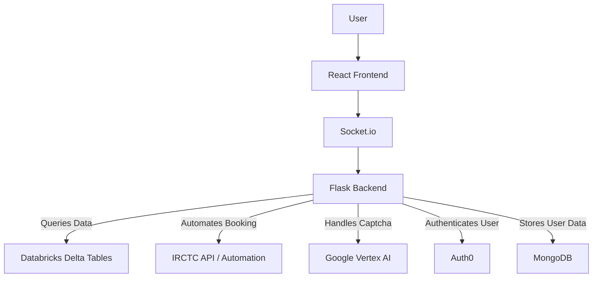

---

# **ATVM - Accessible Ticket Vending Machine Chatbot**  

ATVM is an AI-powered, voice-enabled chatbot designed to revolutionize the travel booking experience. It simplifies ticket booking, food ordering, and more, offering a user-friendly platform for everyone, including the elderly and individuals with disabilities.  

Built with a focus on accessibility, ATVM seamlessly integrates with services like **IRCTC**, **Zomato**, **Swiggy**, and more, delivering a streamlined experience for travel and associated services.

---

## **Key Features**  

- **🎤 Voice-Enabled Interaction**  
  Effortlessly book tickets and order food using voice commands.  

- **🚆 Multi-Service Booking**  
  Book train, airplane, and bus tickets, all in one place.  

- **🍱 Food Ordering**  
  Order meals from Zomato or Swiggy directly during your travel booking.  

- **🧠 AI-Powered Chatbot**  
  Utilizes Google’s Gemini Flash model for natural language processing to understand user queries.  

- **🔒 Secure User Authentication**  
  Auth0 integration ensures secure and seamless login.  

- **📊 Real-Time Data Visualization**  
  Uses Databricks Delta Tables for train schedules, availability, and fares.  

---

## **Tech Stack**  

| Component               | Technology           | Purpose                              |  
|-------------------------|----------------------|--------------------------------------|  
| Frontend Framework      | React.js            | User Interface                      |  
| Backend Framework       | Flask               | API handling                        |  
| NLP Engine              | Google Gemini Flash | Query understanding                 |  
| Authentication          | Auth0               | Secure user login                   |  
| Data Storage            | MongoDB             | Persistent user data                |  
| Captcha Automation      | Google Vertex AI    | Automated captcha recognition       |  
| Realtime Communication  | Socket.io           | Frontend-backend communication      |  

---

## **Getting Started**  

Follow these steps to set up ATVM locally:  

### **Prerequisites**  
Ensure you have the following installed:  
- **Node.js** and a package manager like `pnpm`, `npm`, or `bun`.  
- **Python 3.x** for the backend.  
- **MongoDB** for storing user data.  

---

### **Client-Side Setup**  

1. Navigate to the `client` directory:  
   ```bash  
   cd client  
   ```  

2. Install dependencies using your preferred package manager:  
   ```bash  
   pnpm install  
   # or  
   npm install  
   # or  
   bun install  
   ```  

3. Start the development server:  
   ```bash  
   pnpm run dev  
   # or  
   npm run dev  
   # or  
   bun run dev  
   ```  

---

### **Server-Side Setup**  

1. Navigate to the `server` directory:  
   ```bash  
   cd server  
   ```  

2. Install required Python packages:  
   ```bash  
   pip install -r requirements.txt  
   ```  

3. Start the backend server:  
   ```bash  
   python3 app.py  
   ```  

---

### **Environment Variables**  
Create a `.env` file in the root directories of both `client` and `server` and add the following:  

#### **For Client**  
```plaintext  
REACT_APP_API_URL=<Your Backend URL>  
```  

#### **For Server**  
```plaintext  
AUTH0_CLIENT_ID=<Your Auth0 Client ID>  
AUTH0_CLIENT_SECRET=<Your Auth0 Secret>  
DB_URI=<Your MongoDB Connection URI>  
IRCTC_API_KEY=<Your IRCTC API Key>  
```  

---

## **Project Architecture**  



---

## **Contributing**  

We welcome contributions to improve ATVM! Here's how you can help:  

1. **Fork the Repository**  
   - Click the "Fork" button at the top-right corner of this page.  

2. **Clone Your Fork**  
   ```bash  
   git clone https://github.com/oyejateen/ATVM.git  
   ```  

3. **Create a New Branch**  
   ```bash  
   git checkout -b feature/your-feature-name  
   ```  

4. **Make Your Changes**  
   - Ensure your code is clean and well-documented.  

5. **Submit a Pull Request**  
   - Push your branch and open a pull request for review.  

---

## **Roadmap**  

- [ ] Fully automate captcha solving using Google Vertex AI.  
- [ ] Add advanced authentication features (MFA, session management).  
- [ ] Integrate additional travel services like cab booking.  
- [ ] Enhance chatbot AI for multilingual support.  

---

## **License**  
This project is licensed under the MIT License. See the [LICENSE](LICENSE) file for details.  

---

## **Connect with Us**  

Feel free to reach out with questions or suggestions:  
  
- **GitHub Issues**: [Submit an Issue](https://github.com/oyejateen/ATVM/issues)  

We’d love to hear your feedback and see how you use ATVM!  

**Star 🌟 this repo if you found it helpful!**  

--- 
